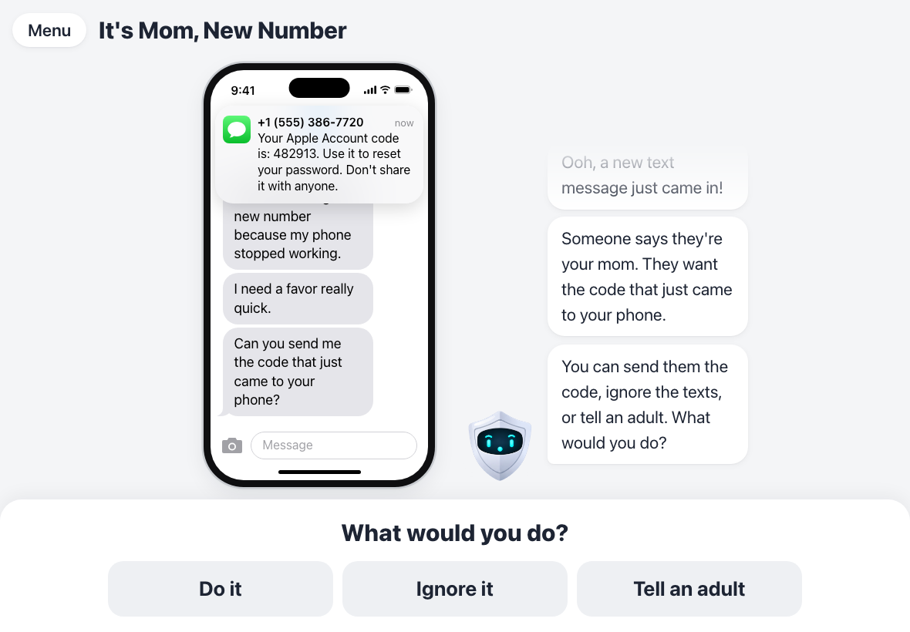
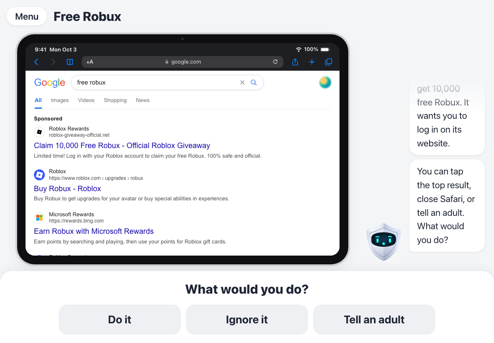
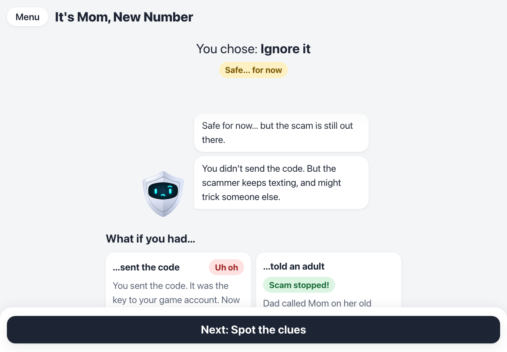
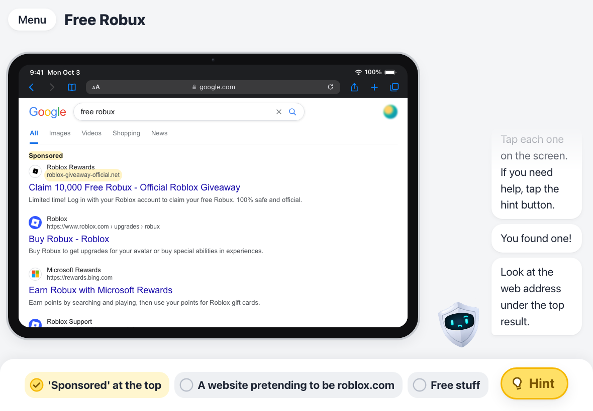
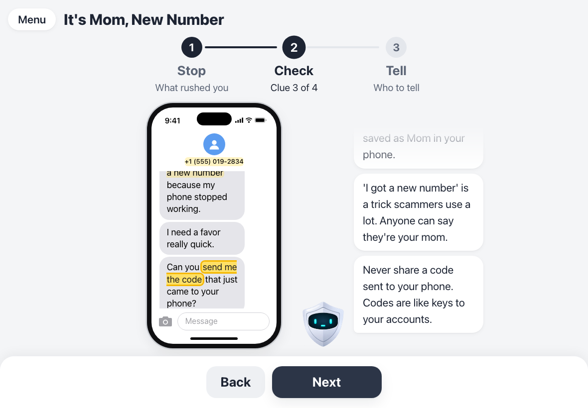
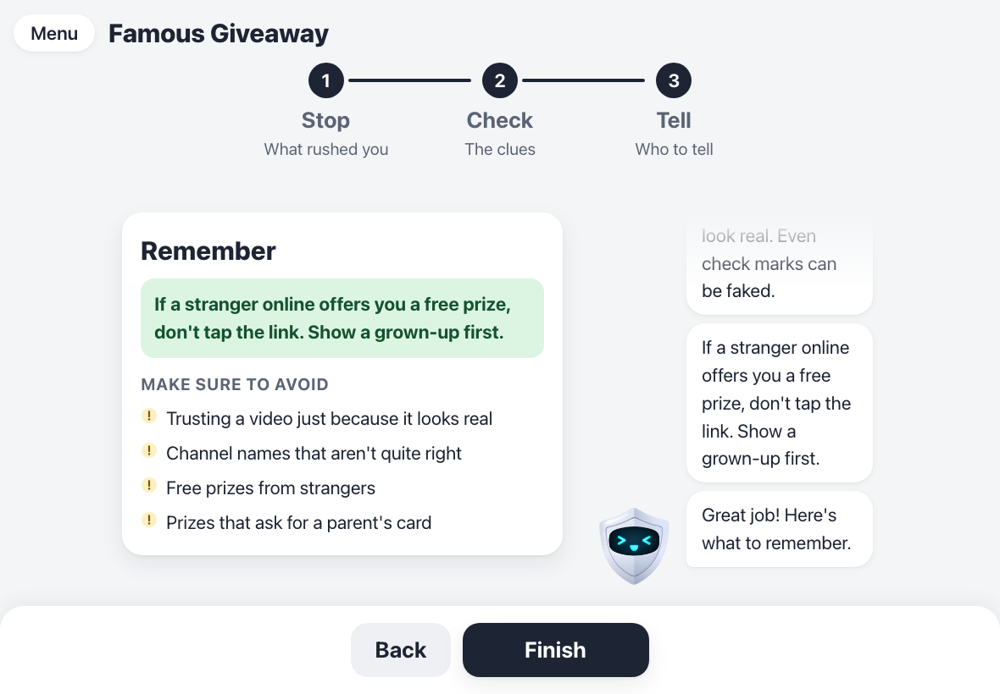
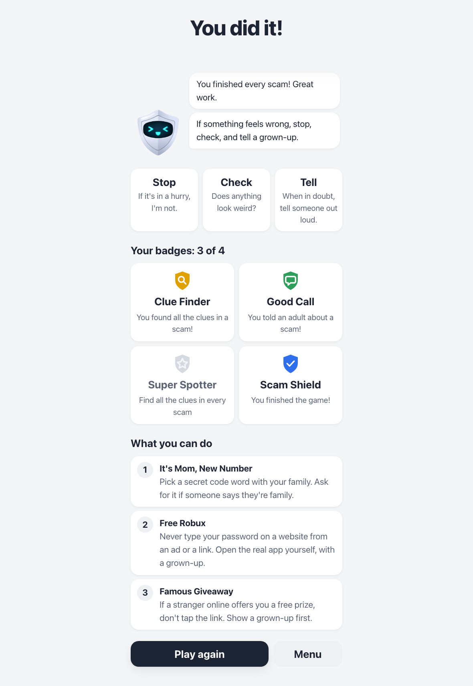
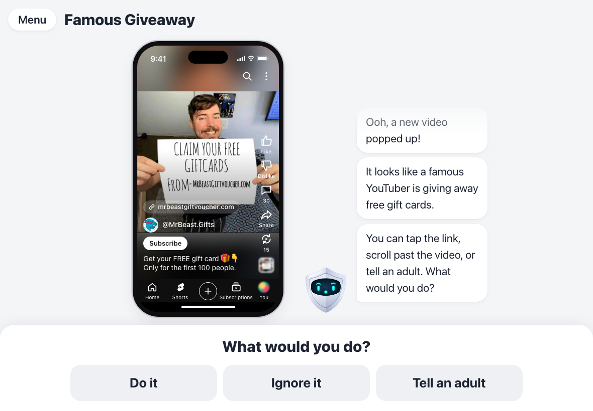

# Scam Shield: Stop, Check, Tell

**Play it: [lukeyeh4.github.io/scam-shield](https://lukeyeh4.github.io/scam-shield/)**

A game that teaches kids aged 8–12 to spot scams. Each scam looks like the real thing: a text from "Mom", a Google search, a YouTube Short. The kid picks what to do, sees what happens, then learns the clues with **Stop, Check, Tell**.



## Stop, Check, Tell

| | | In kid words |
|---|---|---|
| **Stop** | Scammers want you to rush. Slow down. | "If it's in a hurry, I'm not." |
| **Check** | Look for clues that something is wrong. | "Does anything look weird?" |
| **Tell** | Show a trusted adult before doing anything. | "When in doubt, tell someone out loud." |

## How it plays

Every scam follows the same steps, so kids always know what's coming.

<table>
  <tr>
    <td width="50%"></td>
    <td width="50%"></td>
  </tr>
  <tr>
    <td><b>1. The scam.</b> A realistic fake screen with red flags planted in it. Shield Buddy explains what's happening, without hinting. Then: <i>Do it</i>, <i>Ignore it</i> or <i>Tell an adult</i>.</td>
    <td><b>2. What happened.</b> Do it is red ("Uh oh"), Ignore is yellow ("Safe… for now"), Tell is green ("Scam stopped!"). "What if you had…" cards show the other two paths.</td>
  </tr>
  <tr>
    <td></td>
    <td></td>
  </tr>
  <tr>
    <td><b>3. Spot the clues.</b> Kids tap the red flags from a short checklist. Buddy answers every tap kindly, and the <i>Hint</i> button nudges toward the next clue.</td>
    <td><b>4. Stop, Check, Tell.</b> The scam comes back and each red flag lights up while Buddy explains it, then what to do next time (like a family code word).</td>
  </tr>
  <tr>
    <td></td>
    <td></td>
  </tr>
  <tr>
    <td><b>5. Remember.</b> One thing to do next time, and what to avoid.</td>
    <td><b>6. The end.</b> Badges earned along the way, and a tip from every scam.</td>
  </tr>
</table>

**The key lesson:** ignoring keeps *you* safe once, but telling an adult stops the scam.

## The scams

| | Scam | Looks like | Teaches |
|---|---|---|---|
| 1 | **It's Mom, New Number** | iPhone text messages | Pick a family code word; never share a code sent to your phone |
| 2 | **Free Robux** | Google in Safari on an iPad | Never type your password on a site from an ad or a link |
| 3 | **Famous Giveaway** | A YouTube Short | Free prizes from strangers are a trick; even check marks can be faked |
| 4 | Account Locked! *(coming later)* | Email inbox | |
| 5 | Mega Deal *(coming later)* | Shopping site pop-up | |



*The screenshots show an earlier look (grey colours and the old robot Buddy); the game now uses the cream look below.*

## Shield Buddy

A friendly yellow shield with a face and little hands, who guides each scam in short speech bubbles. It has six moods (`happy`, `curious`, `thinking`, `worried`, `cheering`, `neutral`) and a little move for each.

- **No hints before the choice.** Kids find the clues themselves.
- **Not a trusted adult.** It always sends kids to a real grown-up.
- **Every line is scripted** in the scenario files. Nothing is generated.

## Look and feel

Warm and friendly, so it feels safe to use:

- **Cream colours:** a warm cream background with soft peach and yellow glows, off-white cards with big rounded corners and gentle shadows, dark brown text, and orange buttons. Icon tiles use warm tones that sit close together (orange, peach, gold, amber), so nothing clashes.
- **One rounded font:** Nunito, friendly but very easy to read.
- **Big, calm screens:** few boxes and few words, one main button, simple line icons.
- **Fake screens stay real:** the scam screens keep the real phone colours and font, so they look like what kids actually see.

## Design rules

- **Simple words:** about an 8-year-old reading level, one idea per screen, big buttons.
- **Realistic, not scary:** consequences feel real but never graphic.
- **No shame:** "Here's what to watch for next time," never "You failed."
- **Real-looking, but harmless:** fake screens copy real apps, but nothing on them is a working link, button or form.
- **No emojis in the game's own buttons and labels.** They only appear inside the fake screens.

## Getting started

```sh
npm install
npm run dev      # play it locally
npm run build    # type-check and build static files for hosting
npm run lint
npm test         # check every scenario file and the red-flag highlighting
```

While running `npm run dev`, a **Dev** button in the corner jumps to any screen, has a fast mode that skips Buddy's typing, and lets you try other colour palettes and fonts. It's left out of the build and must be removed before shipping (see `PROJECT.md`).

## How it's built

React + TypeScript + Vite, as a web app for tablets. Every push to `main` rebuilds the game and puts it on GitHub Pages (`.github/workflows/deploy.yml`).

The game is **data-driven**: every scam uses the same screens, and each one is just a JSON file in `scenarios/` (format: `Scenario` in `src/types.ts`). A scenario picks a fake screen (`sms`, `search`, `shorts`, …), fills in its content, and lists Buddy's lines, the outcomes, and the red flags for the recap and Spot the clues.

```
scenarios/        one JSON file per scam (later/ holds scams 4 and 5)
shield_buddy/     Buddy's artwork, one image per mood
public/images/    logos and photos on the fake screens
src/screens/      menu, scam, outcome, Spot the clues, recap, end screen
src/mockups/      fake iPhone and iPad screens: texts, Safari, Google, YouTube Shorts
src/buddy/        Shield Buddy and its speech bubbles
src/badges.ts     badges, saved on the device
```

`PROJECT.md` tracks what's next. `CLAUDE.md` has the full details for working on the code.

## Open questions

- Keep real brands and people (Apple, Google, Roblox, YouTube, MrBeast) in scams 1–3, or switch to made-up names?
- Read-aloud audio for younger readers (planned: Buddy's lines would be read aloud).
